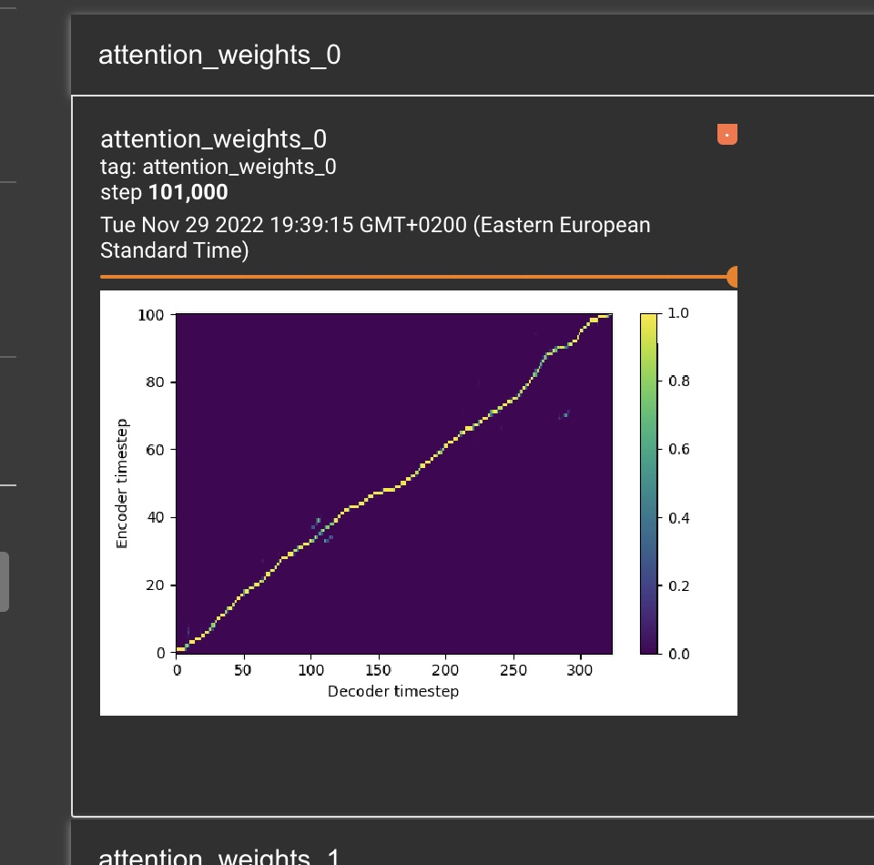
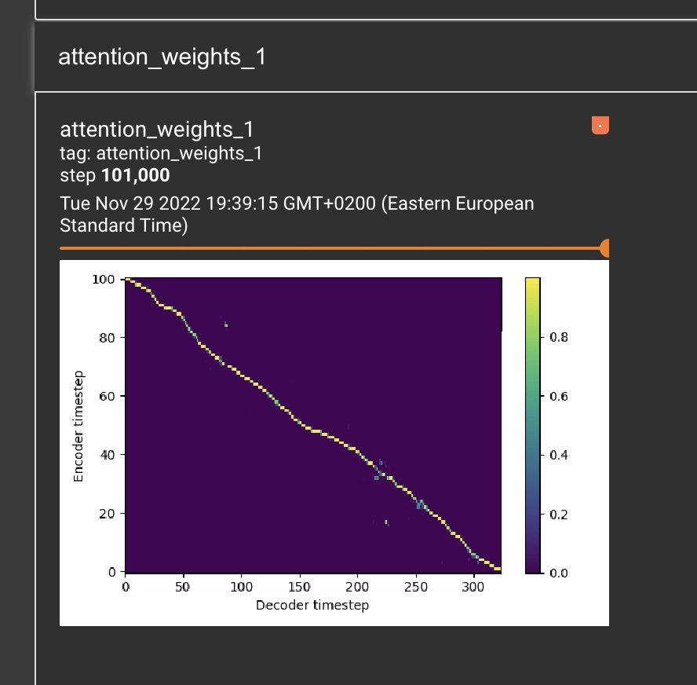
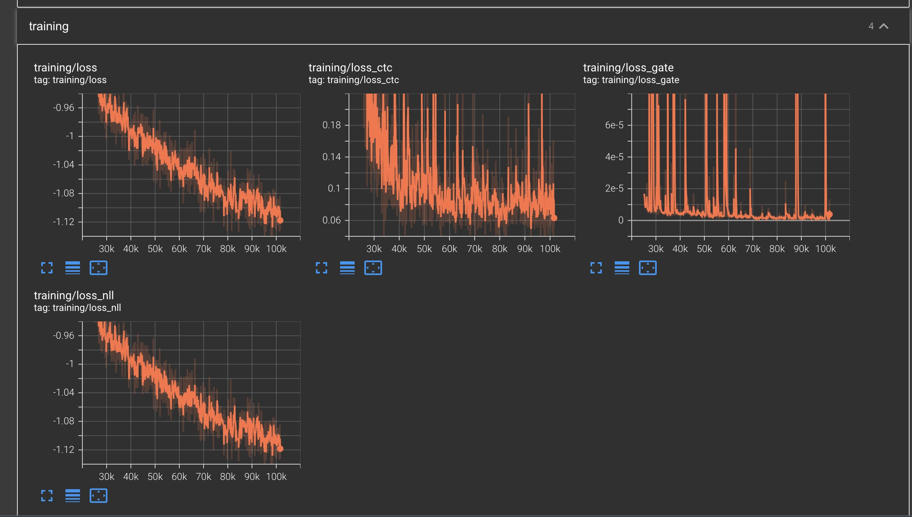
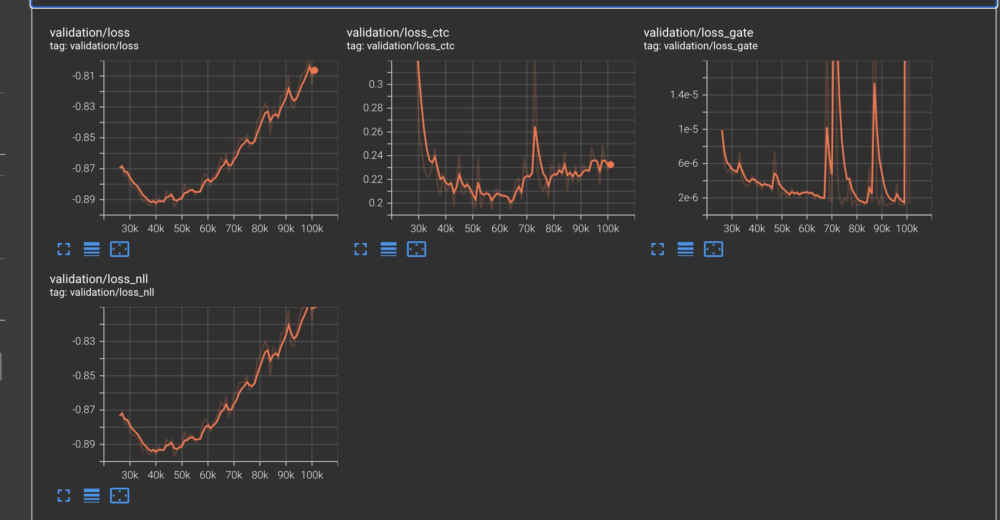

# 🇺🇦 Ukrainian Flowtron TTS

Trained models based on https://github.com/egorsmkv/flowtron

## Install

```
git clone https://github.com/egorsmkv/flowtron

cd flowtron

# Next, read NOTES.txt
```

## Usage

1) Download checkpoints

Look here: https://github.com/egorsmkv/ukrainian-flowtron-tts/releases

2) Do inference

```
python3 inference.py --eng 0 --sigma 0.5 -c config.json -f model_60000.pt -w waveglow_256channels_ljs_v3.pt -t "Вітаю вас, мене звати Лада" -i 0
```

## Model metrics

### Attention

<a href="https://github.com/egorsmkv/ukrainian-flowtron-tts/blob/main/screenshots/attention_weights_0.jpg"></a>

<a href="https://github.com/egorsmkv/ukrainian-flowtron-tts/blob/main/screenshots/attention_weights_1.jpg"></a>

### Training & Validation

<a href="https://github.com/egorsmkv/ukrainian-flowtron-tts/blob/main/screenshots/training.jpg"></a>

<a href="https://github.com/egorsmkv/ukrainian-flowtron-tts/blob/main/screenshots/validation.jpg"></a>


## Look more

- Ukrainian RADTTS: https://github.com/egorsmkv/ukrainian-radtts
